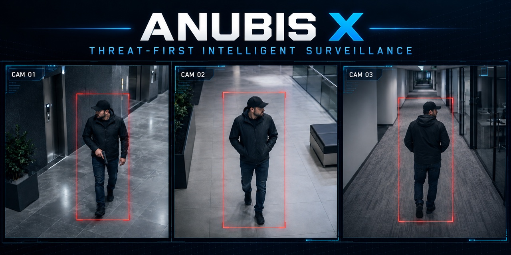
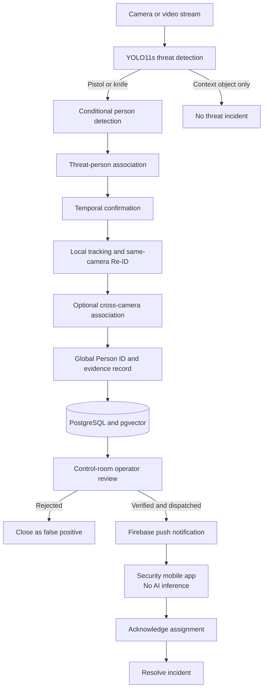
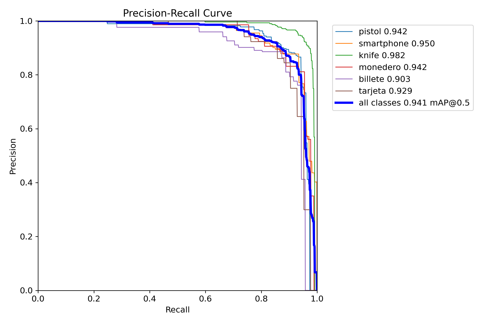
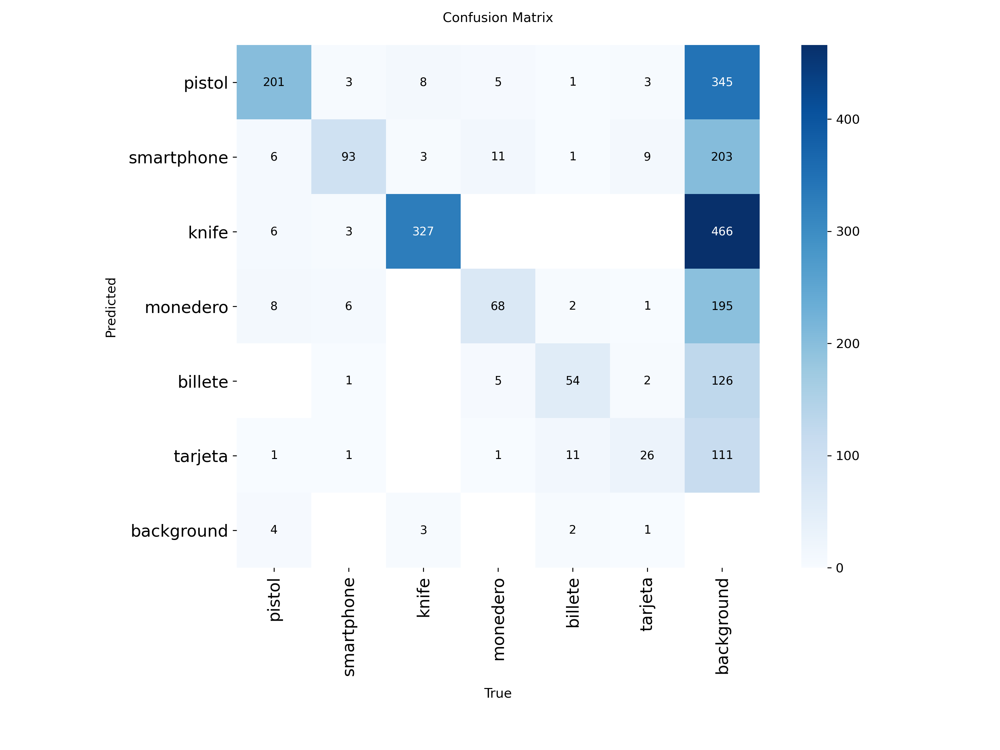
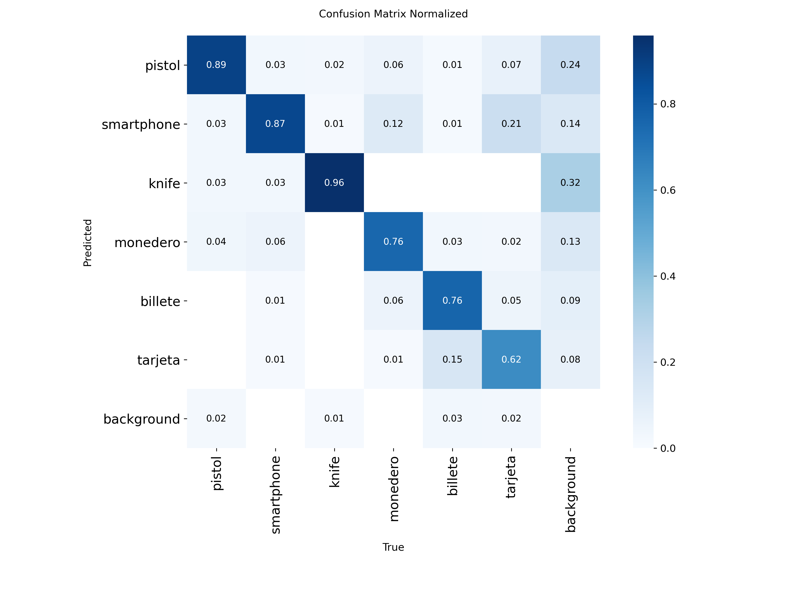
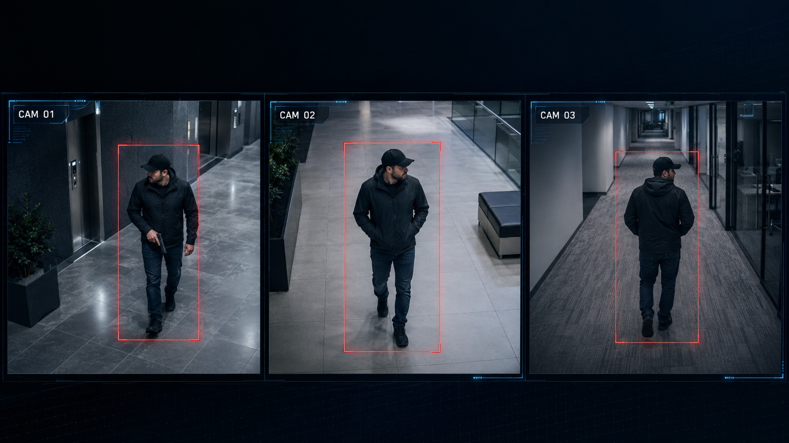

# ANUBIS X

**Threat-first intelligent surveillance for reviewed, trackable, and actionable security incidents.**

ANUBIS X is a graduation-project surveillance platform that connects computer
vision, human verification, and security-team dispatch in one workflow. The
system detects actionable threats, associates them with a person, maintains a
track identity, presents the evidence to a control-room operator, and sends
only verified incidents to a mobile response application.

> This public repository is a portfolio showcase. The implementation source
> code, trained model files, private datasets, credentials, and raw surveillance
> media are intentionally not distributed.

## End-to-end demonstration

This annotated evaluation output shows threat detection, person association,
persistent local tracking, and appearance-based Re-ID working together.

> **Content note:** the demonstration contains incident footage and a visible
> firearm. It is included for non-commercial portfolio and technical-evaluation
> purposes. Rights in any underlying third-party footage remain with their
> respective owners.

### [▶ Watch the full annotated demonstration](demo/anubis-x-threat-tracking-reid-demo.mp4)

## System workflow

The AI pipeline proposes an incident; a human operator decides whether it
should be dispatched. Global Person IDs are internal tracking identifiers and
do not represent a person's real-world identity.

## Core capabilities

- Actionable pistol and knife detection with non-actionable context filtering.
- Conditional person detection activated by threat evidence or track continuity.
- Geometric threat-person association with ambiguity safeguards.
- Temporal confirmation to reduce single-frame false alarms.
- Threat-linked local tracking and same-camera appearance-based reactivation.
- Guarded cross-camera association using appearance and travel-time constraints.
- React control room for camera management, incident review, reports, and dispatch.
- FastAPI backend with JWT access control and PostgreSQL/pgvector persistence.
- Flutter security application for verified alerts, acknowledgement, and resolution.
- Apple Silicon MPS and Linux CPU/NVIDIA deployment profiles.

## Architecture layers

| Layer | Technology | Responsibility |
|---|---|---|
| Threat intelligence | YOLO11s | Detects actionable and contextual objects. |
| Person understanding | YOLO11 + OSNet | Person detection, appearance embeddings, and Re-ID. |
| Tracking logic | Threat-triggered tracking | Preserves threat-linked identity continuity. |
| Backend | FastAPI | Authentication, inference orchestration, incidents, reports, and dispatch. |
| Data | PostgreSQL + pgvector | Incident lifecycle, audit data, and vector-assisted identity matching. |
| Control room | React + Vite | Live monitoring and human verification. |
| Mobile response | Flutter + Firebase | Receives reviewed incidents and manages field response. |

## Evaluation snapshot

The final threat detector was evaluated on a held-out split of 877 images.

| Metric | Result |
|---|---:|
| Precision | 0.863 |
| Recall | 0.898 |
| F1 score | 0.890 |
| mAP@0.5 | 0.941 |
| mAP@0.5:0.95 | ~0.792 |

The reported figures are preserved with the evaluation artifacts below.
Cross-camera association has deterministic component-level validation; a
quantitative real-camera benchmark still requires synchronized or sequential
multi-camera footage with identity ground truth.

### Precision-recall curve

### Confusion matrices

| Absolute | Normalized |
|---|---|
|  |  |

## Multi-camera tracking concept

## Project documents

- [Project presentation](documents/ANUBIS-X-Presentation.pdf)
- [Project poster](documents/ANUBIS-X-Poster.pdf)
- [Held-out metrics JSON](results/held-out-test-metrics.json)

## Privacy and safety boundaries

- No personal camera captures or private test footage are included.
- No credentials, tokens, camera URLs, database files, or Firebase keys are included.
- The mobile application does not run AI inference; it receives operator-reviewed incidents.
- The system-generated tracking ID is not a biometric or civil identity.
- Automated output supports human review and is not presented as an autonomous enforcement decision.

## Repository scope

This repository documents the product, architecture, and measured results for
portfolio review. It is not the implementation repository and cannot be used
to deploy or reproduce the full system.

See [NOTICE.md](NOTICE.md) for copyright and permitted-use terms.
